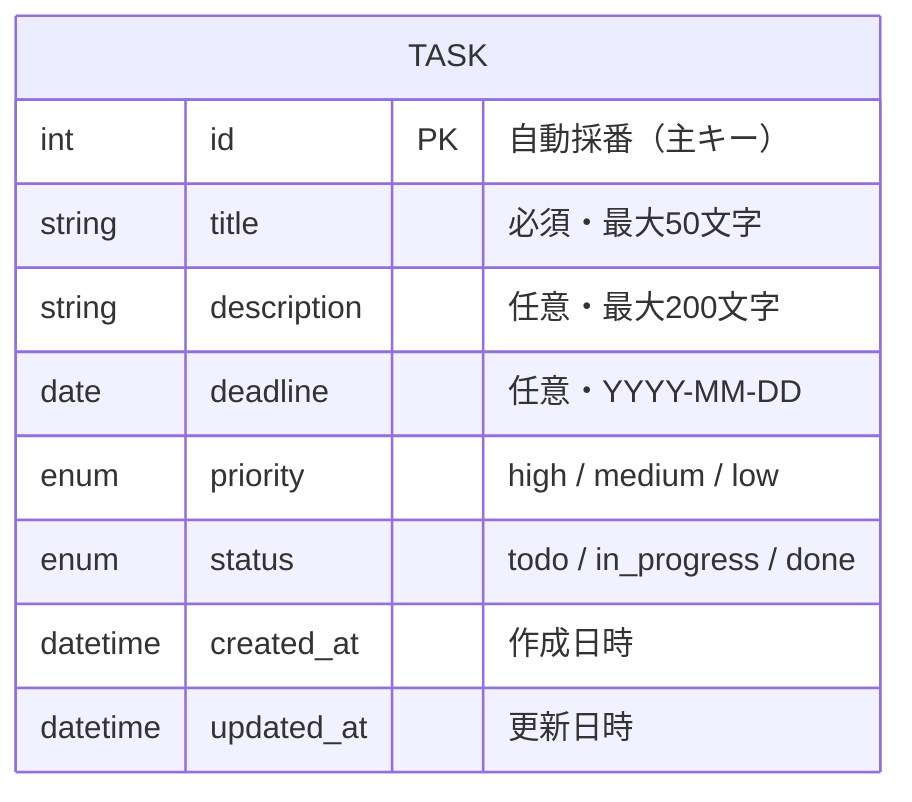

# データ設計

← [要件定義書に戻る](../要件定義書.md)

---

本アプリケーションはバックエンドサーバーを介してデータベースにデータを保存する。使用するDB・サーバー技術は技術選定フェーズで決定する。

---

## エンティティ定義

---

## DBレコード例（概念）

| カラム名 | 値例 |
|----------|------|
| id | 1 |
| title | 要件定義書を作成する |
| description | お客さん向けの説明資料をまとめる |
| deadline | 2026-05-10 |
| priority | high |
| status | in_progress |
| created_at | 2026-05-08 10:00:00 |
| updated_at | 2026-05-08 11:00:00 |

※ 具体的なDB種別・テーブル定義は技術選定フェーズで確定する。
