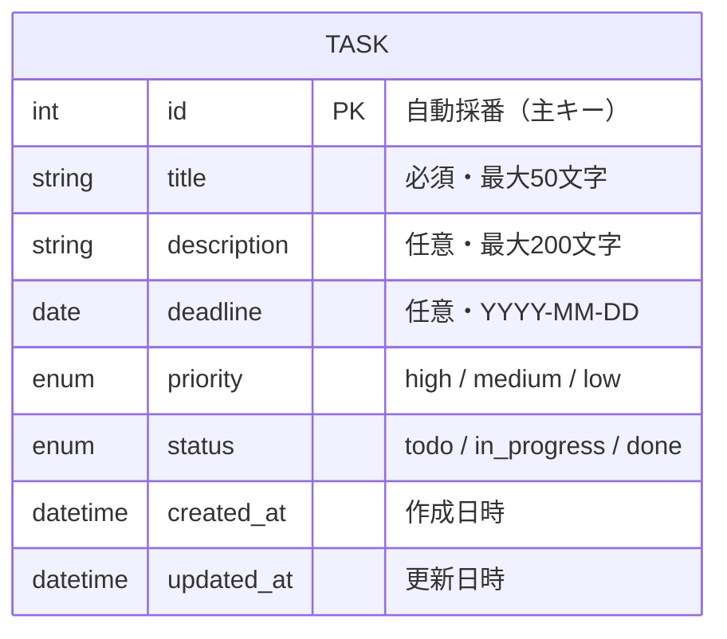

# 要件定義書

## タスク管理アプリケーション

| 項目 | 内容 |
|------|------|
| ドキュメントバージョン | 2.0 |
| 作成日 | 2026-05-06 |
| 更新日 | 2026-05-08 |
| 作成者 | saku-day1 |
| ステータス | ドラフト |

---

## 1. プロジェクト概要

### 1.1 背景・目的
本プロジェクトは、Webアプリケーション開発の学習課題として実施するものである。
課題のテーマとして「タスクの進捗状況を視覚的に管理できるブラウザ上で動作するタスク管理アプリケーション」を開発する。
実務を想定した要件定義・設計・実装の一連のプロセスを体験することが目的である。

### 1.2 対象ユーザー
- 個人でタスクを管理したいユーザー

### 1.3 利用環境
- Webブラウザ（Chrome / Firefox / Safari / Edge）
- バックエンドサーバーをローカル環境で起動して利用する（外部インターネット接続不要）

---

## 2. 機能要件

### 2.1 タスク作成機能
- ユーザーは以下の情報を入力してタスクを作成できる
  - タイトル（必須）
  - 説明文（任意）
  - 期限日（任意）
  - 優先度：高・中・低（任意、デフォルトは「中」）
- 「追加」ボタンを押すことでタスクが作成される
- 作成されたタスクは「未着手」列の先頭に追加される
- タイトルが未入力の場合はエラーメッセージを表示する

### 2.2 タスク表示機能
- タスクはカード形式で表示する
- カードには以下の情報を表示する
  - タイトル
  - 説明文
  - 期限日
  - 優先度ラベル（色分け：赤＝高、黄＝中、緑＝低）
- **期限切れの表示**：期限日が本日より過去の場合、期限日の文字を赤色で表示し「期限切れ」のバッジを付与する
- **タスクの表示順**：各列内では作成日時の降順（新しいものが上）で表示する

### 2.3 ステータス管理機能
- タスクは以下の3つのステータスで管理する
  - 未着手
  - 進行中
  - 完了
- 各カードの「→」ボタンを押すことで次のステータスに移動できる
- 各カードの「←」ボタンを押すことで前のステータスに戻すことができる
  - 「未着手」のカードには「←」ボタンを表示しない
  - 「完了」のカードには「→」ボタンを表示しない
- ステータスごとに列を分けて表示する

### 2.4 タスク編集機能
- 各カードに「編集」ボタンを配置する
- 「編集」ボタンを押すと編集モーダル（ポップアップ）が表示される
- 編集モーダルでは以下の項目を変更できる
  - タイトル（必須）
  - 説明文（任意）
  - 期限日（任意）
  - 優先度（必須）
- 「保存」ボタンを押すと変更が反映される
- 「キャンセル」ボタンまたはモーダル外クリックで変更を破棄して閉じる
- タイトルが未入力の場合はエラーメッセージを表示し保存できない

### 2.5 タスク削除機能
- 各カードに「削除」ボタンを配置する
- 削除前に確認ダイアログ（「このタスクを削除しますか？」）を表示する
- 「OK」で削除、「キャンセル」で中止する

### 2.6 データ保存機能
- タスクのデータはデータベース（DB）に保存する
- ページを閉じて再度開いてもタスクが保持される
- タスクの作成・編集・削除・ステータス変更のたびに即時DBへ反映する
- 使用するDBの種類・構成は技術選定フェーズで決定する

---

## 3. 非機能要件

### 3.1 パフォーマンス
- ページの初期表示は3秒以内に完了すること
- タスクの操作（作成・編集・削除・ステータス変更）はボタン押下後1秒以内に画面に反映されること

### 3.2 ユーザビリティ
- プログラミング経験のないユーザーでも直感的に操作できること
- スマートフォンでも表示が崩れないこと（レスポンシブ対応）
- 各操作に対して視覚的なフィードバック（ボタンのホバー効果など）を提供すること

### 3.3 保守性
- HTML / CSS / JavaScript の3ファイル構成とし、シンプルな設計を維持する
- JavaScriptはモジュール構成を意識し、機能ごとに関数を分離する

### 3.4 データ整合性
- DBへの保存・読み込みは常に一貫したデータ形式で行う
- DBの操作が失敗した場合はユーザーにエラーメッセージを表示する

---

## 4. バリデーションルール

| 項目 | ルール | エラーメッセージ |
|------|--------|----------------|
| タイトル | 必須、1文字以上50文字以内 | 「タイトルを入力してください」/ 「タイトルは50文字以内で入力してください」 |
| 説明文 | 任意、200文字以内 | 「説明文は200文字以内で入力してください」 |
| 期限日 | 任意、日付形式（YYYY-MM-DD） | 「正しい日付を入力してください」 |
| 優先度 | 必須、高・中・低のいずれか（デフォルト：中） | （選択肢のみのため通常発生しない） |

---

## 5. ユースケース・操作フロー

### UC01：タスクを作成する
```
1. ユーザーが入力フォームにタイトルを入力する
2. 必要に応じて説明文・期限日・優先度を入力する
3. 「追加」ボタンをクリックする
4. バリデーションを実行する
   - エラーあり → エラーメッセージを表示し、フォームに留まる
   - エラーなし → タスクを「未着手」列の先頭に追加する
5. 入力フォームをクリアする
```

### UC02：タスクを編集する
```
1. ユーザーが対象タスクのカードの「編集」ボタンをクリックする
2. 編集モーダルが開き、現在の値が入力欄に表示される
3. ユーザーが内容を変更する
4. 「保存」ボタンをクリックする
5. バリデーションを実行する
   - エラーあり → エラーメッセージを表示し、モーダルに留まる
   - エラーなし → カードの内容を更新し、モーダルを閉じる
```

### UC03：タスクのステータスを進める
```
1. ユーザーが対象タスクのカードの「→」ボタンをクリックする
2. タスクが次のステータスの列に移動する
   - 未着手 → 進行中
   - 進行中 → 完了
   （「完了」のカードには「→」ボタンは表示しない）
```

### UC04：タスクのステータスを戻す
```
1. ユーザーが対象タスクのカードの「←」ボタンをクリックする
2. タスクが前のステータスの列に移動する
   - 完了 → 進行中
   - 進行中 → 未着手
   （「未着手」のカードには「←」ボタンは表示しない）
```

### UC05：タスクを削除する
```
1. ユーザーが対象タスクのカードの「削除」ボタンをクリックする
2. 確認ダイアログ「このタスクを削除しますか？」が表示される
3. 「OK」をクリック → タスクを削除し、画面から消去する
   「キャンセル」をクリック → ダイアログを閉じ、何も変更しない
```

---

## 6. 画面仕様

### 6.1 全体レイアウト

```
┌─────────────────────────────────────────────────────┐
│                 タスク管理アプリ                      │
├─────────────────────────────────────────────────────┤
│  入力フォームエリア                                   │
│  [タイトル*] [説明文] [期限日] [優先度▼] [追加ボタン] │
├───────────────┬─────────────────┬───────────────────┤
│   未着手       │    進行中        │      完了          │
│   (件数: N)    │   (件数: N)      │    (件数: N)       │
├───────────────┼─────────────────┼───────────────────┤
│ ┌───────────┐ │ ┌─────────────┐ │ ┌───────────────┐ │
│ │ タイトル  │ │ │ タイトル    │ │ │ タイトル      │ │
│ │ 説明文    │ │ │ 説明文      │ │ │ 説明文        │ │
│ │ 期限: 〇〇│ │ │ 期限: 〇〇  │ │ │ 期限: 〇〇    │ │
│ │ [優先度]  │ │ │ [優先度]    │ │ │ [優先度]      │ │
│ │[編集][削除│ │ │[編集][削除] │ │ │ [編集][削除]  │ │
│ │     [→] │ │ │ [←]   [→]  │ │ │ [←]           │ │
│ └───────────┘ │ └─────────────┘ │ └───────────────┘ │
└───────────────┴─────────────────┴───────────────────┘
```

### 6.2 入力フォーム仕様

| 項目 | 種別 | プレースホルダー | 備考 |
|------|------|----------------|------|
| タイトル | テキスト入力 | 「タスクのタイトルを入力」 | 必須、最大50文字 |
| 説明文 | テキストエリア | 「説明文を入力（任意）」 | 任意、最大200文字 |
| 期限日 | 日付入力（date型） | - | 任意 |
| 優先度 | セレクトボックス | - | 高・中・低、デフォルト「中」 |
| 追加ボタン | ボタン | - | クリックでタスク作成 |

### 6.3 タスクカード仕様

| 項目 | 表示条件 | 備考 |
|------|----------|------|
| タイトル | 常時 | |
| 説明文 | 入力されている場合のみ | |
| 期限日 | 入力されている場合のみ | 期限切れは赤文字＋「期限切れ」バッジ |
| 優先度ラベル | 常時 | 赤＝高、黄＝中、緑＝低 |
| 「←」ボタン | 「進行中」「完了」のみ | |
| 「→」ボタン | 「未着手」「進行中」のみ | |
| 「編集」ボタン | 常時 | |
| 「削除」ボタン | 常時 | |

### 6.4 編集モーダル仕様

- 画面中央にオーバーレイ表示
- 現在のタスク情報を初期値として表示
- 「保存」ボタンで変更を反映
- 「キャンセル」ボタンまたはモーダル外クリックで変更を破棄
- タイトル未入力時は保存ボタンを無効化またはエラーメッセージを表示

---

## 7. E-R 図

本アプリケーションはバックエンドサーバーを介してデータベースにデータを保存する。使用するDB・サーバー技術は技術選定フェーズで決定する。

### エンティティ定義



### DBレコード例（概念）

| カラム名 | 値例 |
|----------|------|
| id | 1 |
| title | 要件定義書を作成する |
| description | お客さん向けの説明資料をまとめる |
| deadline | 2026-05-10 |
| priority | high |
| status | in_progress |
| created_at | 2026-05-08 10:00:00 |
| updated_at | 2026-05-08 11:00:00 |

※ 具体的なDB種別・テーブル定義は技術選定フェーズで確定する。

---

## 8. ファイル構成

```
TaskManagement/
├── frontend/               # Reactフロントエンド
│   ├── src/
│   │   ├── components/     # UIコンポーネント
│   │   ├── App.jsx         # ルートコンポーネント
│   │   └── main.jsx        # エントリーポイント
│   └── index.html
├── backend/                # バックエンドサーバー（技術選定後に確定）
│   └── ...
└── 要件定義書.md
```

---

## 9. 使用技術

| 技術 | 用途 |
|------|------|
| React | フロントエンドUI構築 |
| CSS | デザイン・レイアウト |
| バックエンドサーバー | APIの提供・DB操作（技術選定後に決定） |
| データベース | タスクデータの永続化（技術選定後に決定） |

※ バックエンド・DB種別の選定は後日決定する。

---

## 10. 対象外（スコープ外）

以下の機能は今回の開発対象外とする。

- ユーザーログイン・アカウント管理
- 複数ユーザーでの共同利用
- サーバーへのデータ保存
- ドラッグ＆ドロップによるカード移動
- タスクの担当者割り当て
- タスクの検索・フィルタリング機能
